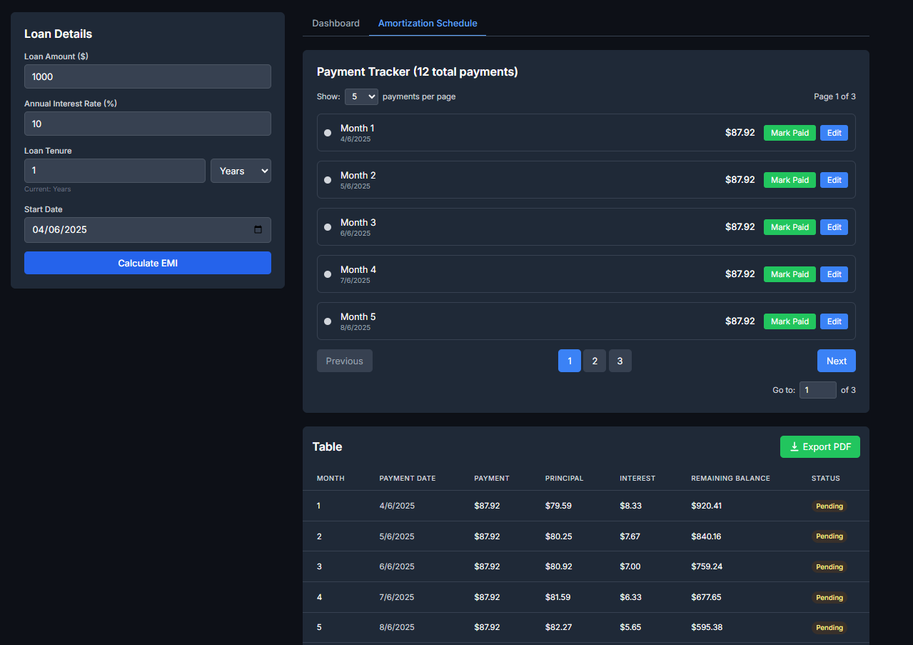

# Next.js Loan Repayment Tracker

  

Live Demo: [loan-repayment-tracker.vercel.app/](https://loan-repayment-tracker.vercel.app/)

## 🚀 Features

### 📝 Loan Management
- Calculate EMI based on loan amount, interest rate, and tenure
- Track payment status (Paid/Pending/Overdue)
- Edit payment details (amount, date) with audit trail

### 📊 Loan Insights

| Metric            | Example Value      |
|-------------------|--------------------|
| Loan Amount       | $25,000           |
| Total Interest    | $4,850 (+19.4%)   |
| Monthly EMI       | $1,237.50         |
| Next Payment Due  | May 15, 2024      |

### 📅 Amortization Schedule
- Principal/Interest breakdown per payment
- Visual payment timeline
- Remaining balance tracking

### 📁 Export Capabilities
- Generate PDF of full repayment schedule
- Printable payment history

## 🛠️ Tech Stack
- **Frontend**: Next.js + TypeScript
- **Styling**: Tailwind CSS
- **PDF Generation**: react-to-pdf
- **Deployment**: Vercel

## 🏁 Quick Start

```bash
git clone https://github.com/Alirazahaider/loan-repayment-tracker.git
cd loan-repayment-tracker
npm install
npm run dev
```

## 💌 Get In Touch

Thank you for checking out this project! If you have any questions, suggestions, would like to collaborate, or need my development services:

[](mailto:alicodespace@gmail.com)
[](https://www.linkedin.com/in/alirazaweb)
[](https://alicodez.vercel.app/)

⭐ Support the project by starring the repository!
[](https://github.com/Alirazahaider/loan-repayment-calculator)
